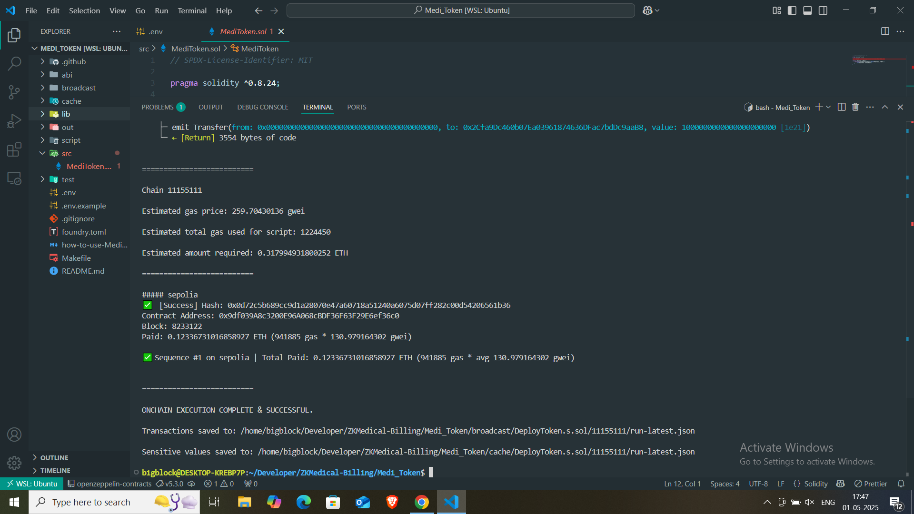
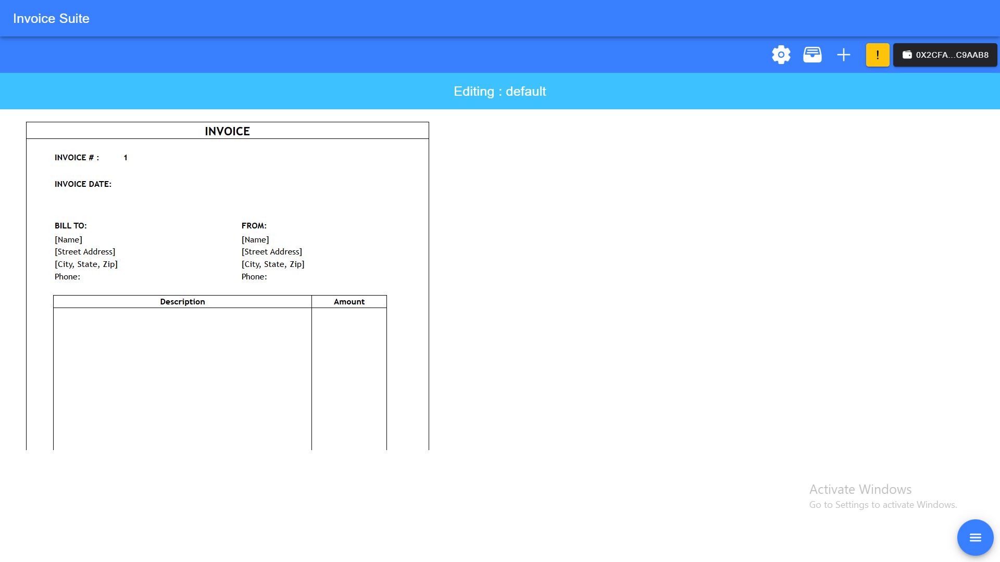
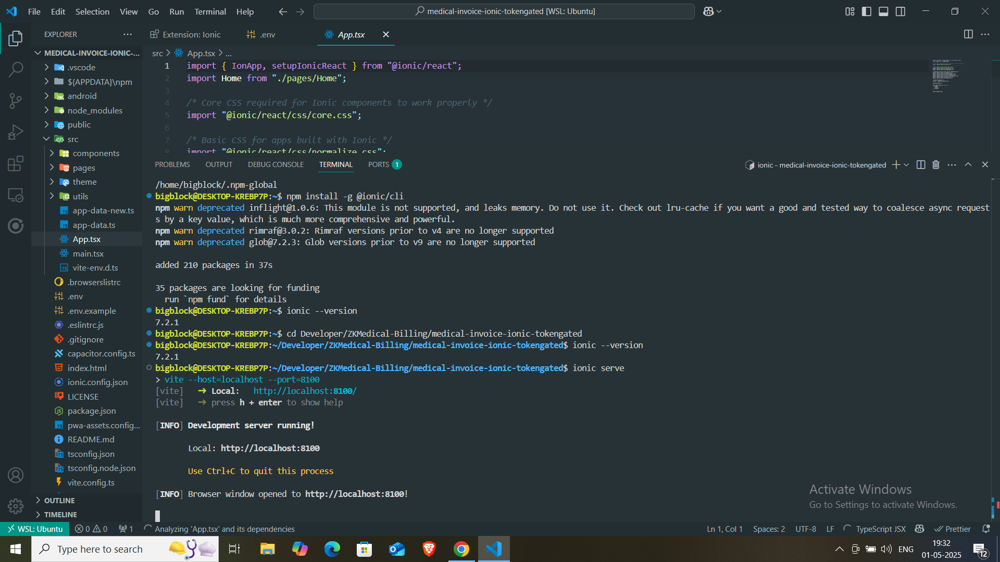
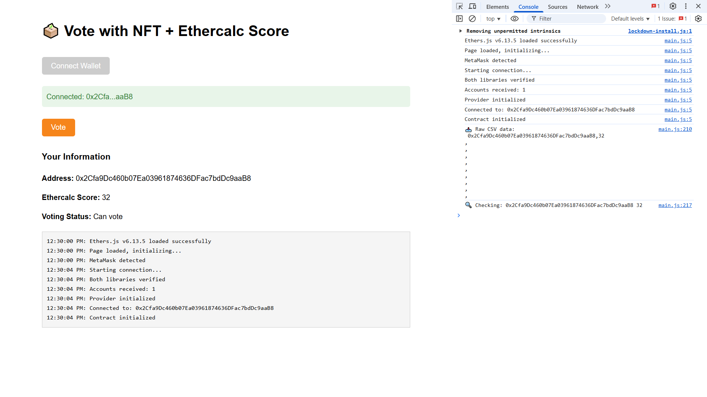
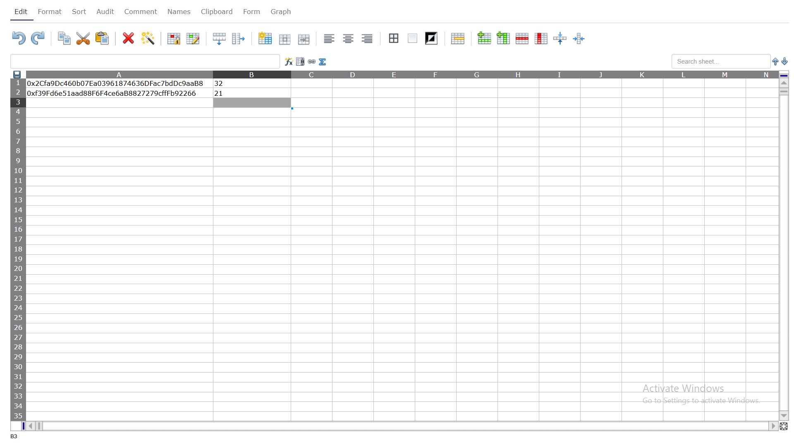
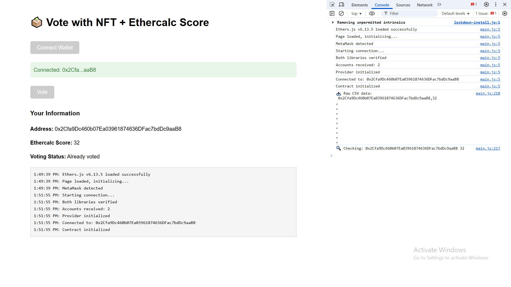
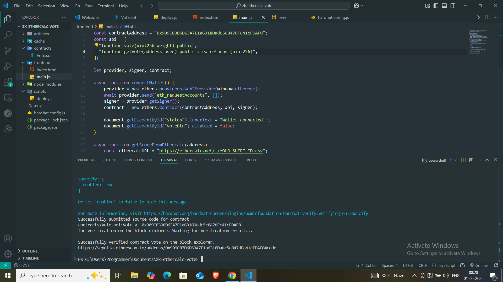

# 🗳️ Vote with NFT + Ethercalc Score

> A decentralized Proof of Concept (PoC) for on-chain voting weighted by off-chain Ethercalc scores, using wallet-based access and smart contracts. Built for the **C4GT 2025 Async Skill Evaluation Challenge**.

---

## 🚀 Project Overview

This project integrates **Web3 smart contracts** and **collaborative off-chain data (Ethercalc)** to simulate a decentralized voting process where:

- 🧮 The vote weight is fetched from Ethercalc based on wallet address.
- 🔐 Each user can only vote once.
- ⛓️ Votes are submitted on-chain via a smart contract.

It demonstrates how **ZK/NFT-based governance** and **collaborative tools like Ethercalc** can work together in real-world applications like grant tracking or scoring-based voting.

---

## ✨ Challenge Completion

✅ Successfully executed and understood both required base modules from the [ZK Medical Billing Platform](https://github.com/seetadev/ZKMedical-Billing):

1. 
2. [contract_address](https://sepolia.etherscan.io/address/0x9df039A8c3200E96A068cBDF36F63F29E6ef36c0)
3. 
4. 

Screenshots and demo are attached below and in the `/screenshots` folder.

---

## 📸 Screenshots

### ✅ Wallet Connected


### 🧠 Ethercalc Data Fetched


### 🗳️ Vote Submitted Successfully


### 🚀 Deployment View


---

## 🛠️ Technologies Used

| Layer        | Tool/Framework             |
|--------------|----------------------------|
| Blockchain   | Ethereum, Solidity         |
| Wallet       | MetaMask                   |
| Web3 Library | Ethers.js                  |
| UI           | HTML, JavaScript           |
| Off-chain DB | Ethercalc (CSV endpoint)   |

---

## 🧠 Learnings

During this challenge, I learned and applied the following:

- ✅ Integrating Ethercalc data with on-chain logic
- ✅ Writing & deploying Solidity smart contracts
- ✅ Reading and writing to smart contracts using Ethers.js
- ✅ Implementing wallet-based gating with MetaMask
- ✅ Debugging CORS, async fetch errors, and address matching
- ✅ Understanding modular Web3 systems like ZKMedical-Billing

This exercise deepened my knowledge of decentralized collaboration and how off-chain data (like CSVs or spreadsheets) can influence blockchain logic securely.

---

## 💡 How It Works

1. Connect your MetaMask wallet.
2. The app fetches your address’s corresponding score from Ethercalc.
3. If the score is valid and you haven’t voted yet, you're allowed to vote.
4. Vote is submitted on-chain using the smart contract.
5. UI updates to reflect voting status and display your score and address.

---

## 🧾 Requirements

- Node.js `v16+`
- MetaMask browser extension installed and connected to a testnet (e.g., Sepolia)
- Public Ethercalc sheet with wallet addresses and scores

---

## 🛠️ Setup Instructions

### 1. Clone this Repository

```bash
git clone https://github.com/jprabhat/zk-ethercalc-vote.git
cd zk-ethercalc-vote
